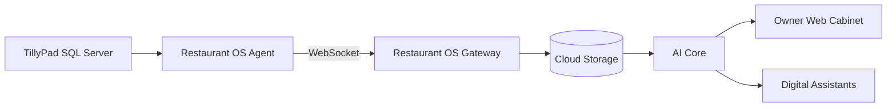

# Restaurant OS

Restaurant OS — облачная операционная система для ресторанов с локальным агентом, Gateway, BI-панелью и цифровыми помощниками.

Проект начался как интеграция с TillyPad, но архитектура рассчитана на подключение других POS-систем через адаптеры.

## Что уже работает

- Windows Agent для подключения к SQL Server TillyPad.
- Постоянное WebSocket-соединение без VPN.
- Gateway на VPS.
- Автоматический деплой через PowerShell.
- Облачное хранение снимков продаж.
- BI-панель.
- Аналитика меню и ABC-анализ.
- Цифровые помощники.
- AI Director.
- Restaurant Health Score и его история.

## Архитектура



Подробности: [`docs/architecture/ARCHITECTURE.md`](docs/architecture/ARCHITECTURE.md)

## Структура проекта

```text
Restaurant OS
├── app/                    # локальная панель и общая логика
├── gateway/                # облачный Gateway и кабинет владельца
├── agent_installer/        # сборка Windows Agent
├── docs/                   # документация продукта и архитектуры
├── deploy_vps.ps1          # автоматический деплой Gateway
├── verify_vps.ps1          # проверка VPS
├── CHANGELOG.md
└── ROADMAP.md
```

## Быстрый старт

### Gateway

```powershell
powershell.exe -NoProfile -ExecutionPolicy Bypass `
  -File ".\deploy_vps.ps1" `
  -VpsHost "YOUR_VPS_IP" `
  -VpsUser "root" `
  -ExpectedVersion "4.2.0"
```

### Agent

```powershell
powershell.exe -NoProfile -ExecutionPolicy Bypass `
  -File ".\agent_installer\build_single_agent.ps1"
```

## Разработка

Работа ведётся через feature-ветки:

```text
main
develop
feature/event-engine
feature/ai-memory
feature/marketing-assistant
fix/login-template
```

Правила: [`CONTRIBUTING.md`](CONTRIBUTING.md)

## Статус

Текущий релиз:

```text
Gateway 4.2.0
Agent 30.0.0
```

Следующий крупный этап: Event Engine и Activity Feed 2.0.
