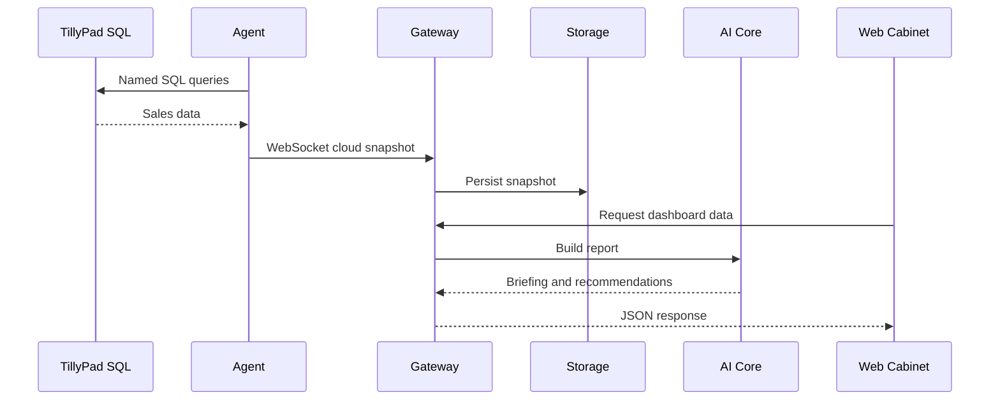

# Architecture

## Контуры

### Restaurant Site

- TillyPad SQL Server
- Restaurant OS Agent
- Local diagnostics UI

### Cloud

- Gateway
- Storage
- AI Core
- Recommendation Engine
- Owner Cabinet

## Поток данных

## Архитектурные ограничения

- Произвольный SQL через Gateway запрещён.
- Agent инициирует только исходящее соединение.
- Секреты не хранятся в Git.
- UI не содержит бизнес-правила.
- Рекомендации формируются серверным AI Core.
